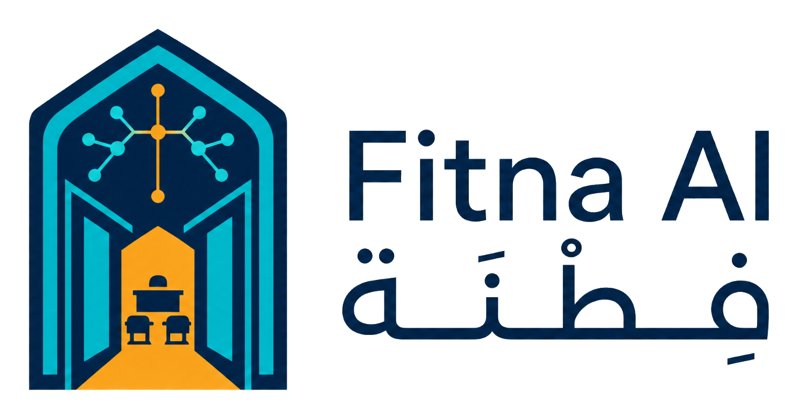
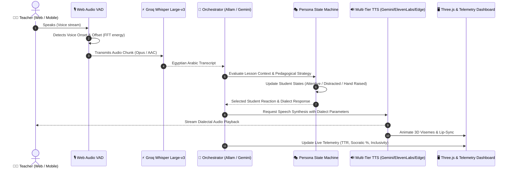

# Fitna AI (فِطنة) — AI-Powered Pedagogical Flight Simulator

<p align="center">
  <picture>
    <source media="(prefers-color-scheme: dark)" srcset="public/logo/logo-light.png">
    <source media="(prefers-color-scheme: light)" srcset="public/logo/logo-dark.png">
    
  </picture>
</p>

<p align="center">
  <strong>The First AI-Powered Interactive Classroom Simulator for Teacher Professional Development in the MENA Region</strong>
</p>

<p align="center">
  
  
  
  
  
  
  
  
</p>

---

## 📌 Executive Summary

**Fitna AI (فِطنة)** is an intelligent pedagogical flight simulator engineered to revolutionize teacher training. Just as pilots spend hundreds of hours in flight simulators before commanding commercial airliners, educators can now rehearse challenging classroom dynamics, refine questioning techniques, and master behavior management within a risk-free, hyper-realistic virtual Egyptian classroom.

Powered by low-latency Speech-to-Text, multi-tier dialectal Text-to-Speech synthesis, and fine-tuned Egyptian Arabic persona models, Fitna AI simulates **autonomous student personalities** responding dynamically in real time to the teacher's tone, pacing, inquiry level, and classroom management strategies.

---

## 🌟 Core Innovations & Key Features

### 1. 🎙️ Zero-Latency Cross-Platform Audio Pipeline
* **Synchronous User-Gesture Priming:** Unlocks Web Audio API `AudioContext` and hardware audio buses synchronously on iOS Safari and Android Chrome to defeat aggressive mobile autoplay blocks.
* **Intelligent Dual-Threshold VAD:** Real-time Voice Activity Detection using 256-FFT frequency bins and energy hysteresis (adaptive speech detection + silent hangtime buffers).
* **Multi-Format Container Ingestion:** Dynamically detects browser audio codecs (`audio/webm;codecs=opus` on Chrome/Firefox/Edge vs. `audio/mp4` / `audio/aac` on iOS Safari).
* **Binary Magic-Byte Detection:** Backend STT router detects file signatures (`webm`, `mp4`, `ogg`, `wav`) to guarantee zero-fail decoding on Groq Whisper Large-v3.

### 2. 🗣️ Autonomous Student Personas & Egyptian Dialect Models
Simulates 4 distinct Egyptian elementary/middle-school personas with persistent emotional states (`attentive`, `hand_raised`, `distracted`, `enthusiastic`):
* **Sara (سارة):** The high-achieving perfectionist who seeks intellectual challenge and craves constructive validation.
* **Omar (عمر):** The energetic, kinesthetic learner prone to distraction who requires active engagement and gamified questioning.
* **Yassin (ياسين):** The reserved, deep thinker who flourishes under compassionate, open-ended Socratic encouragement.
* **Nour (نور):** The inquisitive explorer with relentless curiosity who frequently asks provocative "why" questions.

### 3. 🔊 Multi-Tier High-Fidelity Dialectal TTS Waterfall
Engineered with an automatic zero-fail cascading architecture:
1. **Tier 1 — Google Gemini Direct Audio TTS:** Custom high-naturalness Egyptian Arabic voice mapping (`gemini-2.5-flash-preview-tts` / `gemini-3.1-flash-tts-preview`) using character-matched acoustic personas (`Puck`, `Kore`, `Zephyr`, `Aoede`).
2. **Tier 2 — ElevenLabs Turbo v2.5:** Low-latency conversational multilingual synthesis with custom voice seeds.
3. **Tier 3 — Microsoft Edge Neural TTS:** Resilient zero-cost cloud fail-safe (`ar-EG-SalmaNeural`, `ar-EG-ShakirNeural`).
4. **Tier 4 — NAMAA Egyptian Dialect AI:** Tailored regional dialect checkpoint.

### 4. 📊 Real-Time Pedagogical Telemetry
* **Teacher Talk Ratio (TTR):** Measures the balance between teacher monologue and student dialogue (target: 30%–45% teacher talk).
* **Socratic Questioning Rate:** Identifies inquiry depth, rewarding open-ended, thought-provoking prompts over rote memorization.
* **Classroom Inclusivity Index:** Tracks equity of teacher attention across all 4 students to prevent single-student bias.
* **Behavioral Pattern Classifier:** Automatically detects transitions between `balanced`, `disruptive`, and `disengaged` classroom atmospheres.

### 5. 🎖️ Post-Session Analytics, Radar Matrix & Badges
* **6-Axis Competency Radar:** Visual evaluation across *Clarity*, *Engagement*, *Socratic Technique*, *Classroom Control*, *Inclusivity*, and *Feedback Loop*.
* **LLM Actionable Feedback:** Concrete timestamps, transcribed pedagogical dilemmas, and personalized growth interventions.
* **Gamification & Badges Engine:** Unlocks verified pedagogical badges with strict database-level criteria:
  * 🚀 *Pioneer Teacher (المعلم الرائد)*
  * 🔥 *Streak Master (بطل الاستمرارية)*
  * 🏛️ *Socrates Incarnate (سقراط الفصل)*
  * 🎧 *Master Listener (المستمع الحكيم)*
  * ⚖️ *Inclusive Educator (معلم العدالة والشمول)*
  * 🛡️ *Classroom Captain (قائد الفصل)*
* **Export & Sharing:** Cryptographically secure public shareable session reports and high-resolution PDF exports.

### 6. 🔒 Enterprise-Grade Multi-Tenancy & Data Isolation
* Native **Supabase SSR Cookie Authentication** with middleware route guards.
* **PostgreSQL Row Level Security (RLS)** ensuring airtight tenant isolation between Institutional Admins, Teachers, and Public Interactive Demo environments.

---

## 🏛️ System Architecture



---

## 💻 Tech Stack

| Domain | Technology | Description |
| :--- | :--- | :--- |
| **Framework** | [Next.js 16.3.3](https://nextjs.org/) | App Router, Turbopack, React Server Components (RSC) |
| **Core UI** | [React 19.2.8](https://react.dev/) | Concurrent rendering, Server Actions, Transitions |
| **Styling** | [Tailwind CSS v4](https://tailwindcss.com/) | Modern high-performance styling engine |
| **3D Simulation** | [Three.js](https://threejs.org/) / [@react-three/fiber](https://r3f.docs.pmnd.rs/) | Procedural avatars, visemes, and classroom environment |
| **Database & Auth** | [Supabase](https://supabase.com/) | Managed PostgreSQL 15, SSR Cookie Auth, Storage, RLS |
| **STT Engine** | [Groq](https://groq.com/) `whisper-large-v3-turbo` | Real-time multilingual & dialectal speech recognition |
| **LLM & Reasoning** | [Allam-2-7b](https://groq.com/) & [Google Gemini 2.5](https://deepmind.google/technologies/gemini/) | Arabic pedagogy, dialog generation & behavioral dynamics |
| **TTS Synthesis** | Gemini Direct Audio / ElevenLabs / Edge TTS | Multi-tier Egyptian dialect speech generation |
| **Icons & Design** | [Lucide React](https://lucide.dev/) | Clean, accessible vector iconography |

---

## 📂 Project Directory Structure

```text
fitna-ai/
├── public/                       # Static branding, 3D assets, audio sound effects
├── src/
│   ├── app/                      # Next.js App Router (RSC & Client Pages)
│   │   ├── (auth)/               # Auth flows (login, register, reset-password)
│   │   ├── (marketing)/          # Landing page, value proposition, feature overview
│   │   ├── api/
│   │   │   ├── analyze/          # Post-session LLM analysis & 6-axis scoring
│   │   │   ├── personas/         # Student persona interaction & response orchestration
│   │   │   ├── stt/              # Audio ingestion & Whisper-large-v3 transcription
│   │   │   ├── tts/              # Multi-tier dialectal TTS synthesis waterfall
│   │   │   └── curriculum/       # Lesson topics, curriculum standards & prompts
│   │   ├── dashboard/
│   │   │   ├── teacher/          # Teacher personal dashboard, badges, and history
│   │   │   └── institution/      # Institutional analytics, teacher performance & cohorts
│   │   ├── session/
│   │   │   ├── setup/            # Simulation configuration (class size, subject, difficulty)
│   │   │   ├── room/             # Live 3D simulation room & audio loop
│   │   │   └── report/           # Session radar charts, transcript & interventions
│   │   └── share/                # Public cryptographically secured session reports
│   ├── components/
│   │   ├── classroom/            # 3D avatars, viseme synchronizers, seat layout
│   │   ├── audio/                # Visualizers, microphone HUD, volume meters
│   │   ├── ui/                   # Reusable atomic design components
│   │   └── telemetry/            # Live TTR meters, inquiry dials & alerts
│   ├── hooks/
│   │   ├── useAudioRecorder.ts   # Web Audio VAD & cross-platform recording engine
│   │   └── useClassroomSocket.ts # Real-time state synchronizer
│   └── lib/
│       ├── audio/                # Magic-byte detection, PCM decoding, VAD helpers
│       ├── supabase/             # Server/client SSR authenticated clients
│       └── tts/                  # Gemini, ElevenLabs, and Edge TTS clients
├── supabase/
│   ├── schema.sql                # Complete PostgreSQL schema, tables, triggers & RLS
│   └── seed.sql                  # Seed curriculum and Egyptian persona prompts
├── .env.example                  # Environment variable blueprint
├── package.json
└── tsconfig.json
```

---

## 🚀 Getting Started

### 1. Prerequisites
* **Node.js:** `v20.x` or later (LTS recommended)
* **npm:** `v10.x` or higher
* **Supabase Project:** Active Supabase project with PostgreSQL
* **API Keys:** Groq, Google Gemini, and optionally ElevenLabs & Resend

### 2. Clone the Repository
```bash
git clone https://github.com/mariamhisham24/Fitna-ai.git
cd Fitna-ai
```

### 3. Install Dependencies
```bash
npm install
```

### 4. Database Setup
1. Open your Supabase Dashboard -> **SQL Editor**.
2. Run the script located in `supabase/schema.sql`. This sets up:
   * Identity tables (`users`, `user_roles`)
   * Simulation logs (`sessions`, `messages`, `analytics`)
   * Gamification structures (`badges`, `user_badges`)
   * Automated triggers and Row Level Security policies.

### 5. Configure Environment Variables
Copy `.env.example` to `.env.local`:
```bash
cp .env.example .env.local
```
Populate `.env.local` with your credentials:
```env
# Supabase
NEXT_PUBLIC_SUPABASE_URL=https://your-project.supabase.co
NEXT_PUBLIC_SUPABASE_ANON_KEY=your-anon-key
SUPABASE_SERVICE_ROLE_KEY=your-service-role-key

# Speech & AI Inference
GROQ_API_KEY=your-groq-api-key
GEMINI_API_KEY=your-gemini-api-key
ELEVENLABS_API_KEY=your-elevenlabs-key # Optional fallback

# Application URL
NEXT_PUBLIC_APP_URL=http://localhost:3000
```

### 6. Run Local Development Server
```bash
npm run dev
```
Open [http://localhost:3000](http://localhost:3000) in your browser.

---

## 📱 Mobile Audio Support & Compatibility

Fitna AI features a purpose-built audio layer engineered to comply with strict mobile browser policies:
* **Synchronous Hardware Unlock:** On iOS (Mobile Safari) and Android (Chrome), tapping the microphone button synchronously resumes the `AudioContext` during the user gesture callback, eliminating silent audio playback locks.
* **Apple Silicon & iOS Ingestion:** Audio streams on iOS are packaged in native `audio/mp4` containers and converted on-the-fly without requiring proprietary external client libraries.
* **Hysteresis VAD:** Prevents mobile background noise and classroom echoes from triggering false student interruptions.

---

## 🛡️ Security & Privacy

* **Zero Leakage RLS:** Institutional analytics and individual teacher transcripts are completely segregated at the PostgreSQL layer.
* **Ephemeral Audio Processing:** Voice inputs are transcribed in-memory and discarded post-inference; raw audio recordings are never persisted to long-term storage without user consent.
* **Role-Based Access Control:** Built-in middleware verifies claims before granting access to institutional portals (`/dashboard/institution`).

---

## 👥 Meet the Team

Developed with passion to empower the next generation of educators in Egypt and across the Arab world.

* **Mariam Hisham** — Lead Engineering & AI Architecture ([@mariamhisham24](https://github.com/mariamhisham24))
* **Hassan Yehia** — AI Engineer & Co-Founder

---

## 📄 License

This project is licensed under the MIT License — see the [LICENSE](LICENSE) file for details.
